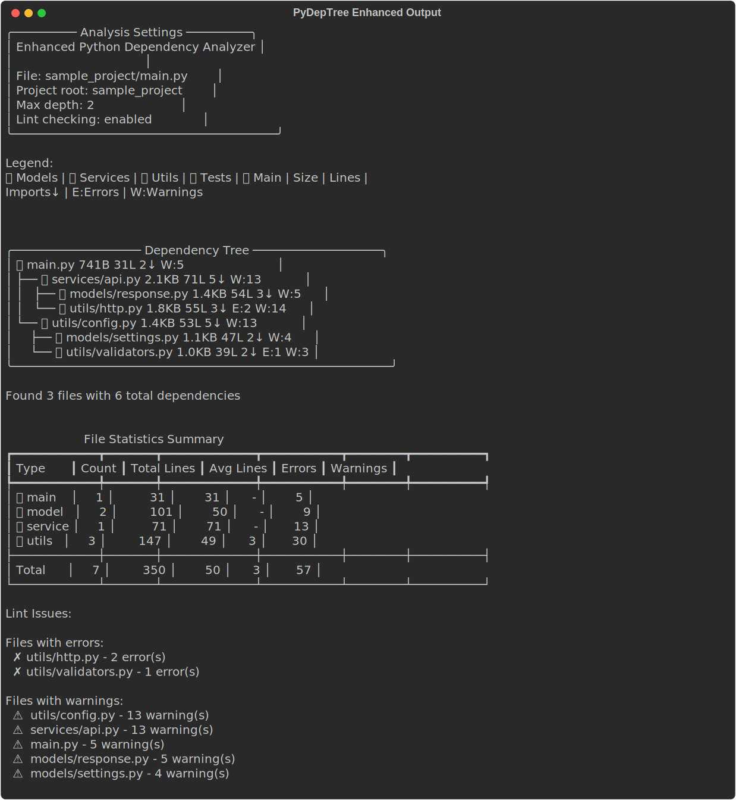
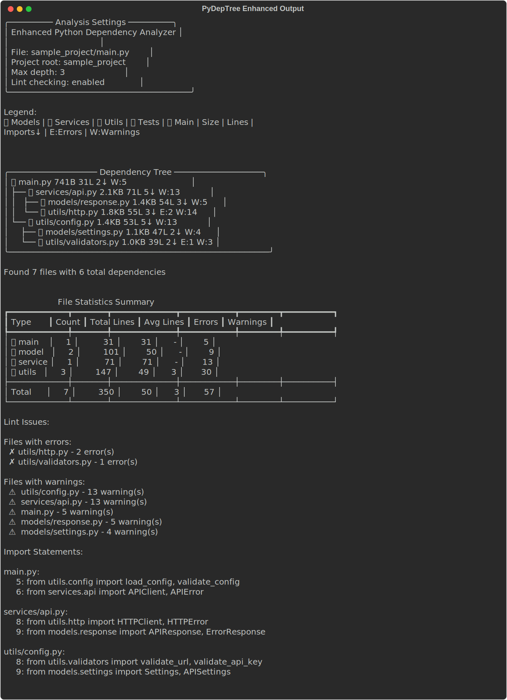

## Enhanced CLI Output Examples

### Basic Enhanced Analysis

```bash
python -m pydeptree.cli_enhanced sample_project/main.py --depth 2
```



### With Import Statements

```bash
python -m pydeptree.cli_enhanced sample_project/main.py --depth 3 --show-code
```



### Available Output Formats

For documentation purposes, you can also capture the output as:
- **HTML**: `console.save_html("output.html")` - Full Rich formatting for web display
- **SVG**: `console.save_svg("output.svg")` - Vector format perfect for GitHub/docs
- **Text**: Plain text format for embedding in documentation

